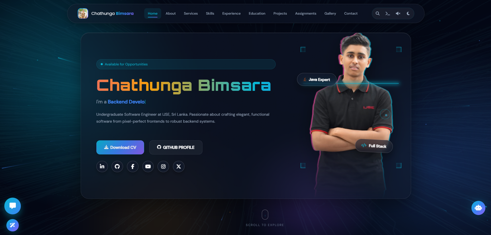
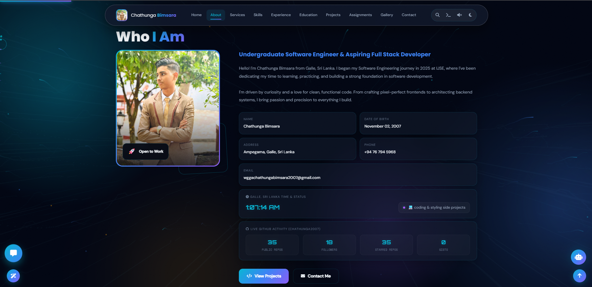
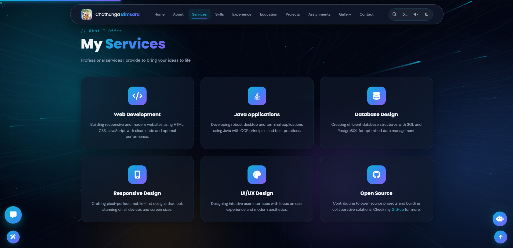
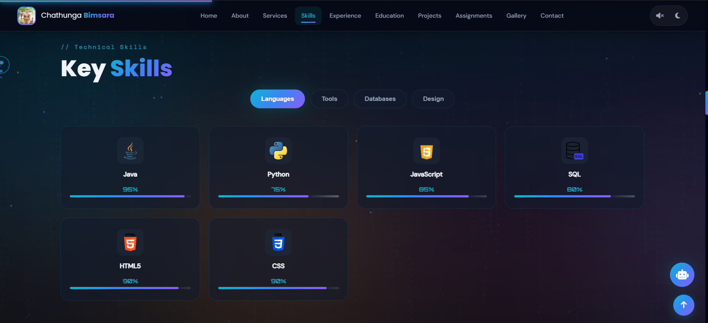
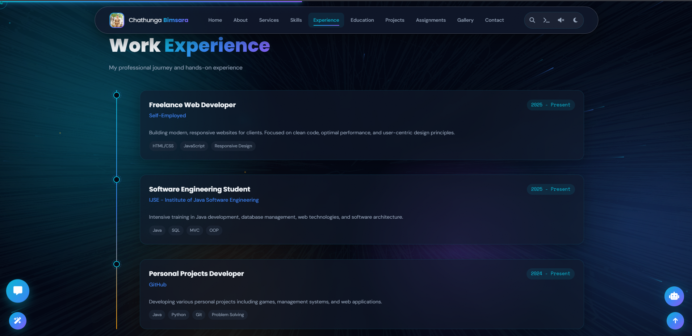
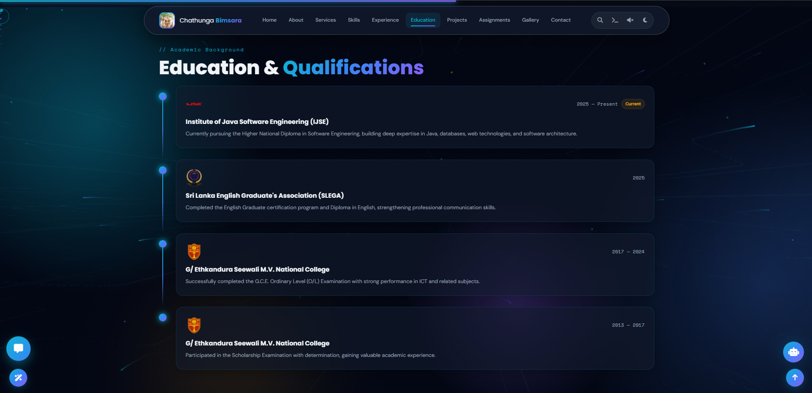
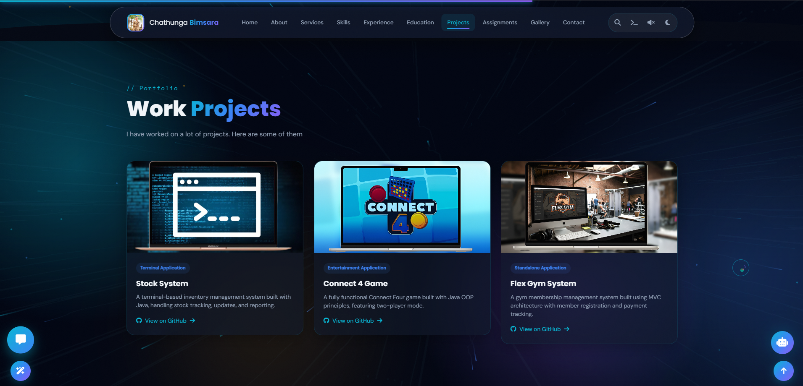
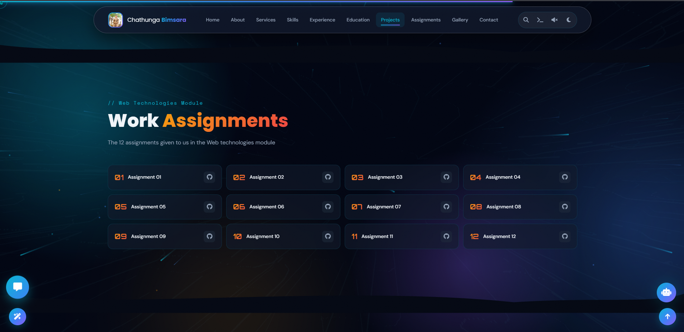
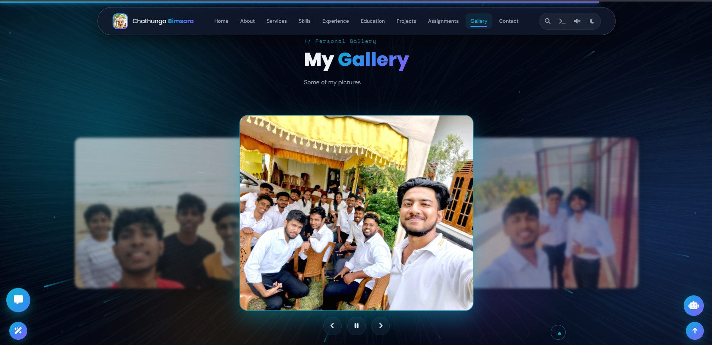
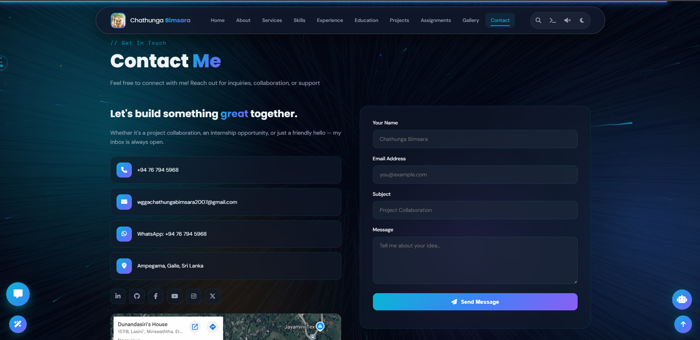

# 🌟 Chathunga Bimsara | Personal Portfolio Website

Welcome to the repository of my official personal portfolio website! This project is a modern, responsive, and dynamic showcase of my skills, experiences, educational background, and portfolio of projects. Built with a focus on smooth animations, clean UI/UX, and an engaging user experience.

- **Live Preview:** [My Personal Portfolio](https://chathunga-bimsara-portfolio-web.vercel.app/)

## 🚀 Features & Sections

The website is divided into several interactive sections, each designed to provide comprehensive information about my professional journey.

### 🏠 Home / Hero Section
The landing page features a dynamic background, a glitch text effect for my name, and quick links to my socials and resume.

### 👨‍💻 About Me
Detailed background information, my journey as a Software Engineering student at IJSE, and my passion for clean code.

### 🛠️ Services
A showcase of the professional services I provide, including Web Development, Java Applications, and UI/UX Design.

### ⚡ Technical Skills
An interactive, tabbed section highlighting my proficiency in Languages, Tools, Databases, and Design tools.

### 💼 Work Experience
A timeline of my professional career, freelance work, and personal project development.

### 🎓 Education & Qualifications
My academic background, from schooling to my current Higher National Diploma in Software Engineering.

### 📁 Work Projects
A gallery of my completed projects, including standalone applications, games, and management systems, with links to their respective GitHub repositories.

### 📚 Assignments
A collection of assignments completed during the Web Technologies module.

### 📸 Gallery
A carousel of personal pictures.

### 📬 Contact Me
A fully functional contact form (powered by FormSubmit) and my contact details, including a Google Maps embed of my location.

---

## 🛠️ Technologies Used

*   **Frontend:** HTML5, CSS3 (Vanilla), JavaScript (Vanilla)
*   **Icons:** FontAwesome
*   **Fonts:** Google Fonts (Syne, DM Sans, Space Mono, Orbitron, Poppins)
*   **Form Handling:** FormSubmit

## ✨ Special Highlights
*   Custom Matrix & Network canvas background effects
*   Aurora background animations
*   Custom cursor styling
*   Dark/Light theme toggle
*   Integrated AI Chatbot UI (Powered by Gemini)
*   Interactive gallery with Lightbox support

---

## 📫 Connect With Me

*   **LinkedIn:** [Chathunga Bimsara](https://www.linkedin.com/in/chathunga-bimsara-02a728387/)
*   **GitHub:** [@chathunga2007](https://github.com/chathunga2007)
*   **X (Twitter):** [@ChathungaB2007](https://x.com/ChathungaB2007)
*   **Facebook:** [Chathunga Bimsara](https://web.facebook.com/profile.php?id=61571681231357)
*   **Email:** wggachathungabimsara2007@gmail.com

---
*© 2025 Chathunga Bimsara — All rights reserved.*
